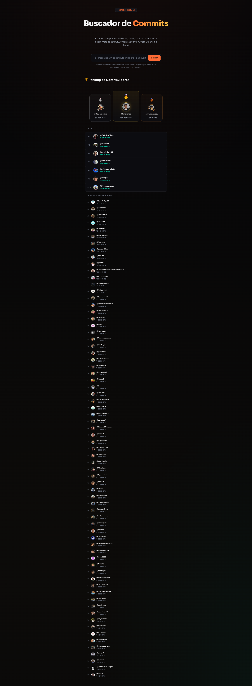
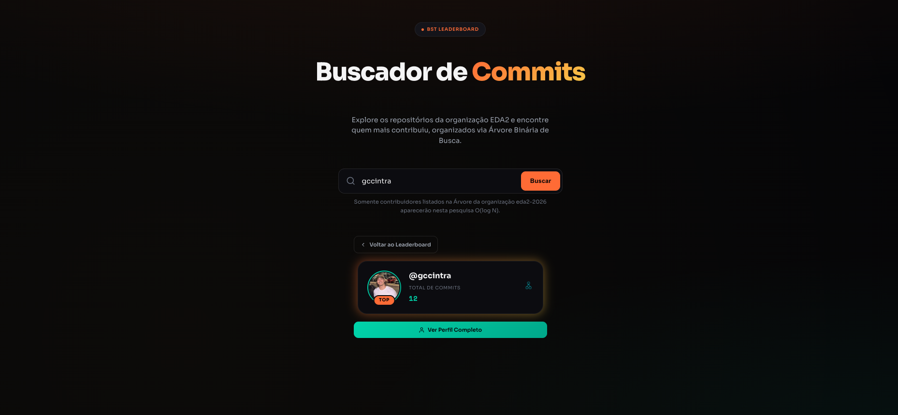
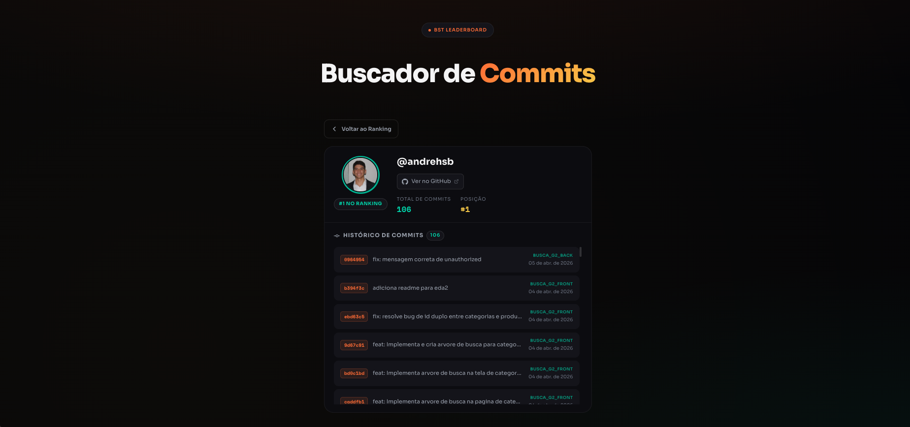

# GitHub Leaderboard BST

Número da Lista: 34<br>
Conteúdo da Disciplina: Estrutura de Dados e Algoritmos II<br>

## Alunos
| Matrícula | Aluno |
| -- | -- |
| 232037786 | Gustavo da Costa Cintra |
| 211030765 | Guilherme Storch de Oliveira | 

## Sobre

O **GitHub Leaderboard BST** é uma aplicação web full-stack que consome a API pública do GitHub para agregar o total de commits dos contribuidores da organização `eda2-2026` e exibir um ranking gamificado.

O projeto tem como objetivo principal demonstrar a utilização de estruturas de dados eficientes em memória, especificamente **Árvores Binárias de Busca (BST)**, para organizar e buscar dados sem necessidade de banco de dados tradicional.

### Funcionamento

1. Ao iniciar o servidor, a aplicação faz fetch na organização GitHub configurada
2. Para cada repositório da organização, são coletados todos os commits
3. Os commits são agregados por username, evitando duplicatas
4. Os dados são inseridos em duas BSTs em memória:
   - **RankingTree**: Ordenada por número de commits (para ranking)
   - **SearchTree**: Ordenada por username (para buscas rápidas)
5. O frontend consome a API REST para exibir o leaderboard e perfis dos usuários

## Screenshots

### Leaderboard


### Busca de Usuário


### Perfil do Usuário


## Demonstração


## Instalação

Linguagem: TypeScript<br>
Framework: Backend (ElysiaJS), Frontend (React + Vite)<br>

### Pré-requisitos

- [Bun](https://bun.sh/) instalado (versão 1.3.9 ou superior)
- Token de autenticação do GitHub

### Instalação das dependências

```bash
# Instalar dependências do backend
cd backend && bun install

# Instalar dependências do frontend
cd frontend && bun install
```

### Configuração

1. Copie o exemplo de variáveis de ambiente:

```bash
cp backend/.env.example backend/.env
```

2. Edite o arquivo `backend/.env` e adicione seu token do GitHub:

```env
GITHUB_TOKEN=seu_token_aqui
```

**Como obter um token do GitHub:**
1. Acesse GitHub → Settings → Developer settings → Personal access tokens → Tokens (classic)
2. Crie um novo token com escopo `public_repo` (necessário para ler repositórios públicos)
3. Copie o token gerado

### Execução

```bash
# Terminal 1 - Backend (porta 3000)
cd backend && bun run dev

# Terminal 2 - Frontend (porta 5173)
cd frontend && bun run dev
```

### Acessos

- **Frontend:** http://localhost:5173
- **Backend API:** http://localhost:3000

## Outros

### Estrutura de Dados

O projeto utiliza duas Árvores Binárias de Busca (BST) em memória:

- **RankingTree**: Ordenada por número de commits — travessia In-Order Reversa para ranking decrescente
- **SearchTree**: Ordenada por username — busca binária O(log n)

### Stack Tecnológica

- **Backend:** Bun 1.3.9 + ElysiaJS + TypeScript
- **Frontend:** React 19 + Vite 8 + TypeScript
- **Package Manager:** Bun

